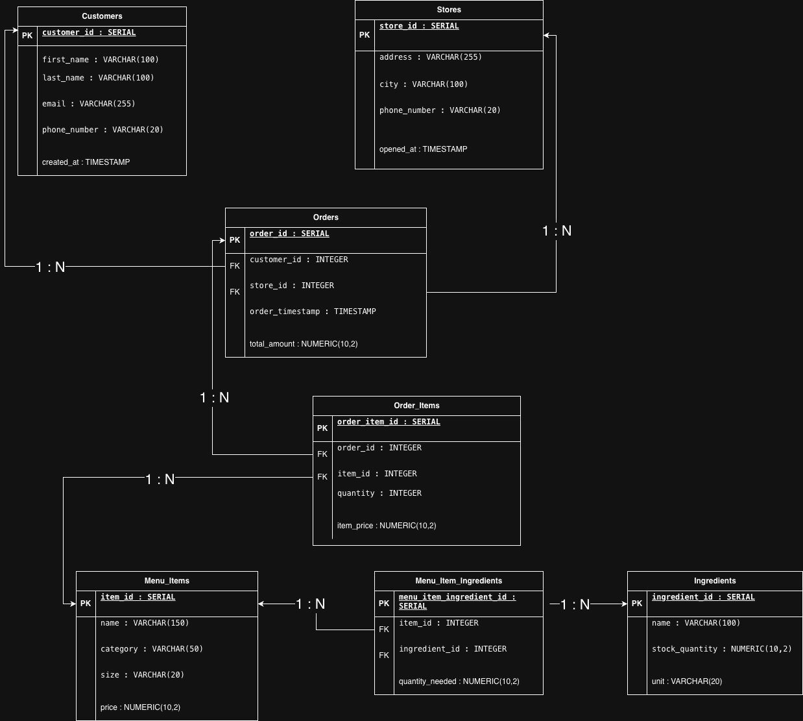

# 🍕 Chima's Pizza House — Enterprise Database System

## Project Overview

Chima's Pizza House is a growing pizza chain that previously relied on a simple `orders.json` file to manage customer orders. As the business expanded to multiple locations with a growing customer base and complex menu, this flat-file system became a critical bottleneck — slow, impossible to query for insights, prone to data corruption, and unable to support concurrent access by multiple cashiers.

This project replaces that fragile system with a **production-ready PostgreSQL relational database** deployed on **Google Cloud Platform (GCP)**. The database serves as a single source of truth for all business operations including stores, customers, menu items, ingredients, and order transactions.

To demonstrate the system's capabilities without compromising real customer privacy, the database was populated with **20,000+ rows of realistic synthetic data** generated using Python's Faker library — simulating real-world business activity across 5 store locations.

## Tech Stack

| Technology | Purpose |
|---|---|
| **PostgreSQL 18** | Relational Database Management System |
| **Google Cloud SQL** | Cloud-hosted database service (DBaaS) |
| **Python 3.13** | Data population scripting |
| **psycopg2** | PostgreSQL database adapter for Python |
| **Faker** | Synthetic data generation |
| **python-dotenv** | Environment variable management |
| **pgAdmin** | Database administration and querying |
| **draw.io** | Entity-Relationship Diagram design |

## Database Schema

The database is normalized to **Third Normal Form (3NF)** and consists of 7 tables:

| Table | Description | Row Count |
|---|---|---|
| **Stores** | Physical pizzeria locations | 5 |
| **Customers** | Registered customer information (PII) | 1,000 |
| **Ingredients** | Raw ingredients for menu items | 48 |
| **Menu_Items** | Product catalog (pizzas, sides, drinks) | 26 |
| **Orders** | Master transaction records | 5,000 |
| **Order_Items** | Line items for each order | 14,944 |
| **Menu_Item_Ingredients** | Recipe mappings (menu item ↔ ingredient) | 51 |

### Entity-Relationship Diagram



### Key Design Decisions

- **`price` on Menu_Items**: Added to enable order total calculations and analytics.
- **`item_price` on Order_Items**: Captures the price at time of purchase, ensuring historical accuracy even if menu prices change.
- **`Menu_Item_Ingredients` junction table**: Enables the many-to-many relationship between menu items and their ingredients.
- **`ON DELETE SET NULL` on Orders.customer_id**: Preserves order history if a customer account is deleted.
- **`ON DELETE RESTRICT` on Orders.store_id**: Prevents deletion of a store that has associated orders.
- **Performance indexes** on foreign key columns used in JOINs and WHERE clauses.

## Project Structure

```
chimas-pizza-house/
├── sql/
│   ├── chimas_pizza_schema.sql      # CREATE TABLE statements + indexes
│   └── analytics_queries.sql        # 5 business analytics queries
├── python/
│   └── populate.py                  # Faker data population script
├── docs/
│   └── erd.png                      # Entity-Relationship Diagram
├── screenshots/
│   ├── gcp_dashboard.png            # GCP Cloud SQL instance
│   ├── pgadmin_tables.png           # pgAdmin showing table row counts
│   └── query_results/               # Analytics query result screenshots
├── .env                             # Database credentials (not committed)
├── .gitignore                       # Excludes .env and sensitive files
└── README.md                        # Project documentation
```

## How to Run

### Prerequisites
- Python 3.10+
- PostgreSQL database (local or cloud)
- pgAdmin (optional, for visual administration)

### 1. Clone the Repository
```bash
git clone https://github.com/your-username/chimas-pizza-house.git
cd chimas-pizza-house
```

### 2. Install Dependencies
```bash
pip install psycopg2-binary faker python-dotenv
```

### 3. Configure Environment Variables
Create a `.env` file in the project root:
```
DB_HOST=your_database_host
DB_NAME=chimas_pizza_db
DB_USER=postgres
DB_PASSWORD=your_password
DB_PORT=5432
```

### 4. Run the Schema
Execute `sql/chimas_pizza_schema.sql` in pgAdmin or psql to create the database tables.

### 5. Populate the Database
```bash
python python/populate.py
```

This will insert:
- 5 stores
- 1,000 customers with unique emails and phone numbers
- 48 ingredients across 6 categories
- 26 menu items (pizzas, sides, drinks)
- 5,000 orders with ~15,000 order line items
- 51 recipe-ingredient mappings

## Analytics Queries

The following business questions are answered in `sql/analytics_queries.sql`:

| # | Business Question |
|---|---|
| 1 | What is the total sales revenue per store? |
| 2 | Who are the top 10 most valuable customers by total spending? |
| 3 | What is the most popular menu item by quantity sold? |
| 4 | What is the average order value? |
| 5 | What are the busiest hours of the day for orders? |

## Cloud Deployment

- **Provider**: Google Cloud Platform (GCP)
- **Service**: Cloud SQL for PostgreSQL 18
- **Instance**: `chimas-pizza-db`
- **Database**: `chimas_pizza_db`
- **Region**: US East

## Author

**Chima Charles Ojini**
Data Engineer

---

*Built as a capstone project demonstrating data modeling, cloud deployment, database programming, and analytics.*

